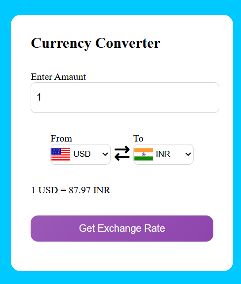

# 💱 Currency Converter

This is a **Currency Converter Web App** built with **HTML, CSS, and JavaScript**.  
It allows users to convert one currency into another using real-time exchange rates.  

---

## 🔗 Live Demo
👉 [Use Converter](https://gulabhussain.github.io/Currency-Converter/)  

---

## ✨ Features
- Convert between **200+ currencies** 🌍  
- Real-time exchange rates using API  
- Simple and user-friendly UI  
- Dropdown menu with country flags & currency codes  
- Responsive design (works on mobile & desktop)  
- Dark/Light mode toggle 🌙☀️ *(if added)*  

---

## 🛠️ Tech Stack
- **Frontend:** HTML, CSS, JavaScript  
- **API:** [CurrencyAPI](https://api.currencyapi.com/v3/latest?apikey=cur_live_yHbDap7glOa3dI5IQUMFEQvnWPhqyoRU005MVskV) (or whichever API you used)  

---

## 📸 Screenshots

